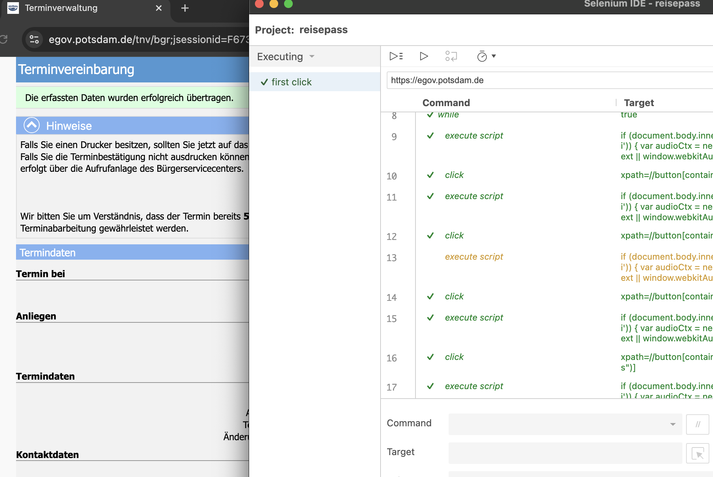

## Intro
### Problem
Potsdam is a beautiful city. But getting an official appointment to get legal stuff done in the Bürgeramt is close to impossible. Theoretically you can book an appointment to get a slot, but appointments are never available. That sucks.

### Solution
Don't sit in front of your laptop and wait until something becomes available, but use a simple script that does this for you!



## Setup
- Install https://www.selenium.dev/selenium-ide/ as extension in your browser
- Load the script named 'potsdam_termin_buchen_buergeramt.side'
- Let the script run. Once it "beeps" you can book an appointment.

## Notes
- This script currently looks for a slot to book 3 passports. But it can of course be adapted to book anything else as well.
- The script itself is simple. It opens the services page, select a service page and cycles through the booking pages until an appointment becomes available. Once it finds an appointment it beeps. You can then take over and book the appointment.
- Most javascript code inside the script is to generate the "beep" nose. Don't let ```var audioCtx = new (wi...``` confuse you :)

